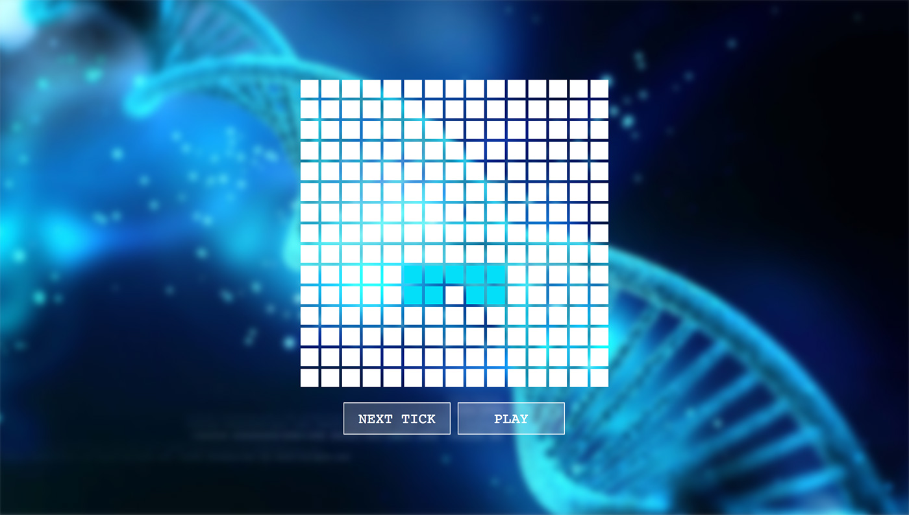

# Conway's Game of Life

[Play the Game of Life now!](https://carlosbaraza.github.io/game-of-life)

This repository is a simple implementation of
[Conway's Game of Life](https://en.wikipedia.org/wiki/Conway%27s_Game_of_Life#Iteration).

# Create React App

For more information about the bootstrapping tool used
for this project, checkout [CREATE_REACT_APP.md](./CREATE_REACT_APP.md).

# Contributing

Feel free to submit PRs with any cool feature you can
imagine.

Some ideas are:

* 3D version
* Posibility to resize the grid
* Allow changing the interval playback time
* PWA posibilities
* Improve responsiveness
